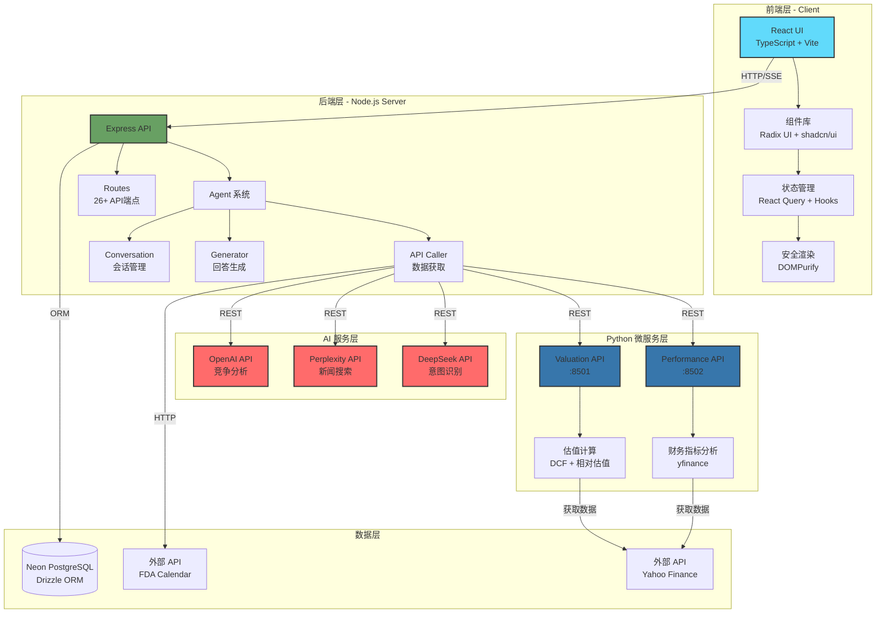
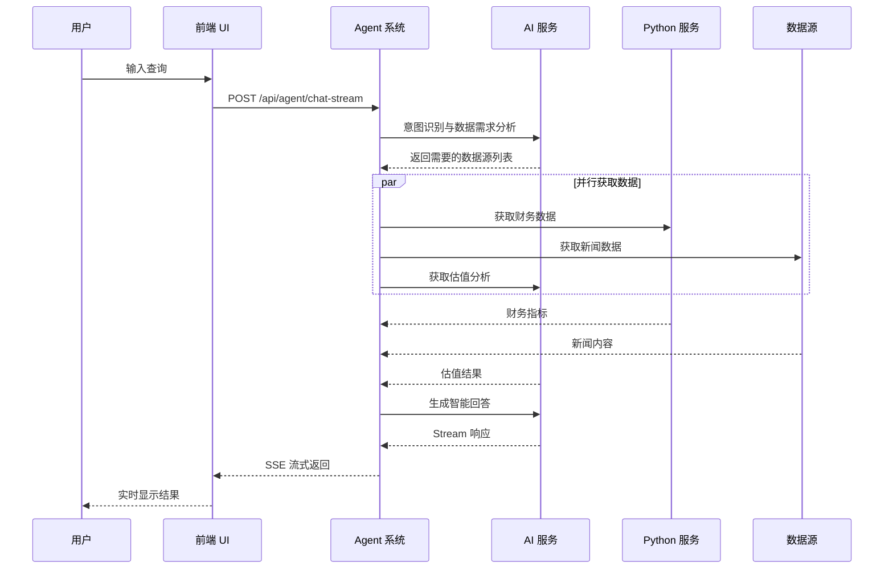
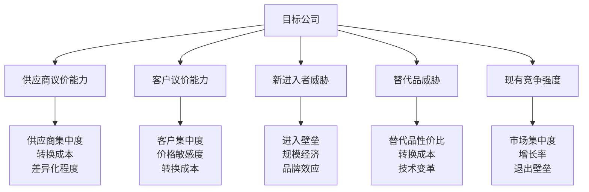
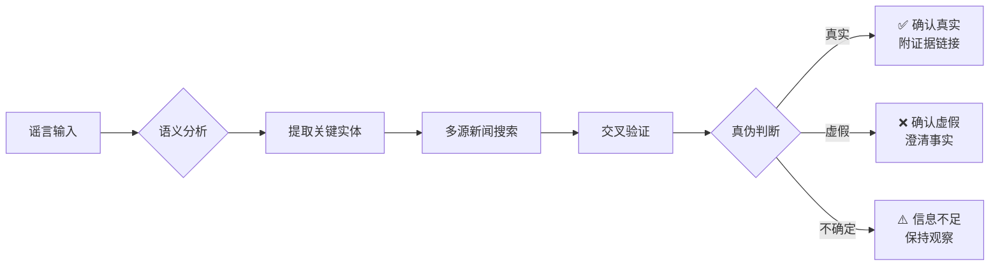

<div align="center">

# 🚀 Equity Research Analyst
### 智能股票投研分析平台

[](https://opensource.org/licenses/MIT)
[](https://nodejs.org/)
[](https://reactjs.org/)
[](https://www.typescriptlang.org/)
[](https://www.python.org/)

**基于 AI 驱动的专业投研工具，为投资者提供全方位的股票研究和决策支持**

[快速开始](#-快速开始) • [功能特性](#-核心功能模块) • [API 文档](#-api-接口文档) • [部署指南](#-部署指南) • [联系我们](#-联系和支持)

</div>

---

## 📖 项目介绍

**Equity Research Analyst** 是一个企业级智能股票投研分析平台，采用先进的 **AI 数据需求分析引擎**和**智能路由系统**。平台集成了 10+ 专业分析模块，支持实时数据获取、多维度分析和智能决策建议，帮助投资者快速获取高质量的投资研究报告。

### 🌟 核心特性

<table>
<tr>
<td width="50%">

#### 🤖 智能分析引擎
- ✅ AI 驱动的查询意图识别
- ✅ 自动数据源分析与路由
- ✅ 多模型融合决策（DeepSeek + Perplexity + OpenAI）
- ✅ 流式响应，实时反馈

#### 📊 财务分析
- ✅ 实时财务指标监控
- ✅ 历史趋势可视化
- ✅ 同行业对比分析
- ✅ 自定义指标计算

#### 💰 估值系统
- ✅ DCF 内在价值计算
- ✅ 相对估值法（P/E, P/S, EV/EBITDA）
- ✅ AI 智能目标价推荐
- ✅ 置信度评分

</td>
<td width="50%">

#### 📰 新闻与情报
- ✅ 多源新闻实时聚合
- ✅ 智能简报自动生成
- ✅ 谣言检测与验证
- ✅ 可信来源追踪

#### 🏭 竞争力分析
- ✅ 波特五力模型
- ✅ 行业格局分析
- ✅ 竞争优势评估
- ✅ 市场定位研究

#### 🔒 安全与合规
- ✅ XSS 防护（DOMPurify）
- ✅ 输入验证与消毒
- ✅ 安全 HTML 渲染
- ✅ 企业级日志系统

</td>
</tr>
</table>

### 🎯 适用场景

- 📈 **个人投资者** - 快速获取专业级投资分析
- 🏢 **机构分析师** - 提高研究效率，辅助决策
- 💼 **基金管理** - 多维度尽职调查
- 🎓 **金融教育** - 学习投资分析方法

### 🌍 多语言支持

完整支持**中文**和**英文**，自动识别用户输入语言并返回对应语言的分析结果。

---

## 🛠️ 技术栈

### 前端技术 (Client)

| 类别 | 技术 | 版本 | 说明 |
|------|------|------|------|
| **核心框架** | React | 18.x | 声明式 UI 框架 |
| **语言** | TypeScript | 5.x | 类型安全的 JavaScript |
| **构建工具** | Vite | 5.4+ | 极速的前端构建工具 |
| **样式方案** | Tailwind CSS | 3.x | 实用优先的 CSS 框架 |
| **UI 组件库** | Radix UI + shadcn/ui | Latest | 无障碍 UI 组件（40+ 组件）|
| **状态管理** | React Query | 5.x | 服务端状态管理 |
| **表单处理** | React Hook Form | Latest | 高性能表单库 |
| **数据验证** | Zod | Latest | TypeScript-first 验证库 |
| **图标** | Lucide React | Latest | 精美的图标库 |
| **安全防护** | DOMPurify | Latest | XSS 防护库 |

### 后端技术 (Server)

| 类别 | 技术 | 版本 | 说明 |
|------|------|------|------|
| **运行时** | Node.js | 18+ | JavaScript 运行时 |
| **框架** | Express.js | Latest | Web 应用框架 |
| **语言** | TypeScript | 5.x | 类型安全 + ESM 模块 |
| **构建工具** | esbuild | Latest | 极速 JavaScript 打包器 |
| **ORM** | Drizzle ORM | Latest | TypeScript ORM |
| **数据库** | Neon PostgreSQL | Latest | Serverless 数据库 |
| **开发工具** | tsx | Latest | TypeScript 执行器 |
| **并发管理** | concurrently | Latest | 多进程管理工具 |

### Python 微服务

| 服务 | 框架 | 端口 | 说明 |
|------|------|------|------|
| **财务性能分析** | Flask | 8502 | 财务指标计算与对比 |
| **估值分析** | Flask | 8501 | DCF 和相对估值计算 |
| **数据获取** | yfinance | - | Yahoo Finance 数据接口 |
| **AI 集成** | DeepSeek API | - | 财务假设推荐 |

### AI 服务集成

| 服务 | 模型 | 用途 |
|------|------|------|
| **DeepSeek** | `deepseek-chat` (V3) | 意图分类、答案生成、翻译 |
| **Google Gemini** | `gemini-2.5-flash` | DeepSeek 不可用时的兜底生成（Google Search 实时搜索）|
| **Perplexity** | `sonar-pro` | 新闻搜索、财报 Q&A 兜底、谣言核查 |
| **Perplexity** | `sonar-reasoning-pro` | 竞争力分析研究（可通过 `COMPETITIVE_RESEARCH_MODEL` 覆盖）|

### LLM 模型配置

> 完整的 AI 模型使用清单，便于维护 API Key 和费用管理。

| 提供商 | 模型 ID | 用途 | 环境变量 | 是否必需 |
|--------|---------|------|----------|----------|
| **DeepSeek** | `deepseek-chat` (V3) | 意图分类 (`classify-intents-multi`) | `DEEPSEEK_API_KEY` 或 `DEEPSEEK_KEY` | ✅ 必需 |
| **DeepSeek** | `deepseek-chat` (V3) | 答案生成（SSE 流式） | 同上 | ✅ 必需 |
| **DeepSeek** | `deepseek-chat` (V3) | 文本翻译、竞争分析 | 同上 | ✅ 必需 |
| **Google Gemini** | `gemini-2.5-flash` | DeepSeek 不可用时兜底生成（含 Google Search 实时搜索）| `GEMINI_API_KEY` | 🟡 可选 |
| **Perplexity** | `sonar-pro` | 新闻搜索、财报 Q&A 兜底、谣言核查 | `PERPLEXITY_API_KEY` | ✅ 必需 |
| **Perplexity** | `sonar-reasoning-pro` | 竞争力分析研究（默认；可通过环境变量改为 `sonar`）| 同上 | ✅ 必需 |

**关键说明：**
- DeepSeek `deepseek-chat` 映射到 **DeepSeek-V3**（平台最新稳定 chat 模型）
- Gemini `gemini-2.5-flash` 为 2.0-flash 的替代（2.0 已于 2026 年退役）
- 竞争分析模型可通过 `COMPETITIVE_RESEARCH_MODEL=sonar` 环境变量覆盖为轻量模型

### 开发工具

- **版本控制**: Git
- **包管理器**: npm
- **代码规范**: ESLint + TypeScript Compiler
- **环境配置**: dotenv
- **进程管理**: PM2 (生产环境)

---

## 🏗️ 系统架构

### 架构设计图



### 数据流程



### 核心模块说明

#### 🎯 Agent 系统 (server/agent/)

智能代理系统，负责查询理解、数据获取和答案生成。

```typescript
agent/
├── index.ts          // Agent 主入口（chat, chatStream）
├── generator.ts      // 回答生成器（流式生成）
├── conversation.ts   // 会话管理（历史记录、上下文）
├── apiCaller.ts      // API 调用器（数据获取和处理）
└── cardFormatter.ts  // 卡片格式化器（结构化输出）
```

**工作流程：**
1. **意图识别** - 分析用户查询，识别所需数据源
2. **数据获取** - 并行调用多个 API 获取数据
3. **智能生成** - 基于数据生成专业的分析报告
4. **流式返回** - Server-Sent Events 实时推送

---

## 📁 项目结构

```
WorkflowDemo/
├── 📂 client/                              # 前端应用
│   ├── index.html                          # 应用入口
│   └── src/
│       ├── 📂 pages/
│       │   ├── home.tsx                    # 主页面（1326 行，核心交互逻辑）
│       │   └── not-found.tsx               # 404 页面
│       │
│       ├── 📂 components/                  # React 组件
│       │   ├── SafeHtmlContent.tsx         # 安全 HTML 渲染（XSS 防护）
│       │   ├── index.ts                    # 组件导出
│       │   └── ui/                         # 基础 UI 组件库（40+ 组件）
│       │       ├── card.tsx, button.tsx, input.tsx
│       │       ├── dialog.tsx, alert.tsx, toast.tsx
│       │       ├── accordion.tsx, tabs.tsx, table.tsx
│       │       └── ... 更多组件
│       │
│       ├── 📂 hooks/                       # 自定义 Hooks
│       │   └── useHelpers.ts               # 工具 Hooks（超时管理、语言检测）
│       │
│       ├── 📂 utils/                       # 工具函数
│       │   ├── constants.ts                # 常量配置（API端点、模块元数据）
│       │   └── i18n.ts                     # 国际化文本（中英文 UI）
│       │
│       ├── 📂 types/
│       │   └── index.ts                    # TypeScript 类型定义
│       │
│       ├── 📂 lib/
│       │   ├── queryClient.ts              # React Query 配置
│       │   └── utils.ts                    # 工具函数（cn 等）
│       │
│       ├── App.tsx                         # 根组件
│       ├── main.tsx                        # React 应用入口
│       └── index.css                       # 全局样式
│
├── 📂 server/                              # Node.js 后端
│   ├── index.ts                            # Express 服务器主文件
│   ├── routes.ts                           # API 路由定义（26+ 端点）
│   ├── storage.ts                          # 数据持久化
│   ├── utils.ts                            # 工具函数（日志、验证）
│   ├── vite.ts                             # Vite 开发服务器集成
│   └── agent/                              # AI Agent 系统
│       ├── index.ts                        # Agent 主入口
│       ├── generator.ts                    # 回答生成器
│       ├── conversation.ts                 # 会话管理
│       ├── apiCaller.ts                    # API 调用器
│       └── cardFormatter.ts                # 卡片格式化器
│
├── 📂 python-services/                     # Python 微服务
│   ├── 📂 performance/                     # 财务性能分析（端口 8502）
│   │   ├── app.py                          # Flask 应用主文件
│   │   ├── metrics_display.py              # 指标展示
│   │   ├── historical_trends.py            # 历史趋势分析
│   │   ├── industry_benchmarking.py        # 行业基准对比
│   │   ├── custom_metrics.py               # 自定义指标
│   │   ├── saved_sets.py                   # 保存的分析集
│   │   ├── company_selector.py             # 公司选择器
│   │   ├── export_reports.py               # 报告导出
│   │   ├── charts.py                       # 图表生成
│   │   ├── requirements.txt                # Python 依赖
│   │   ├── README.md                       # 服务文档
│   │   ├── start.bat                       # Windows 启动脚本
│   │   └── utils/
│   │       ├── calculations.py             # 计算工具
│   │       ├── database.py                 # 数据库操作
│   │       └── financial_data.py           # 财务数据获取
│   │
│   └── 📂 valuation/                       # 估值分析（端口 8501）
│       ├── api_service.py                  # Flask API 服务
│       ├── dcf_calculator.py               # DCF 计算器
│       ├── reverse_dcf.py                  # 反向 DCF（从股价推导假设）
│       ├── relative_valuation.py           # 相对估值法
│       ├── deepseek_client.py              # DeepSeek AI 客户端
│       ├── backtest_reverse_dcf.py         # 反向 DCF 回测
│       ├── debug_dcf.py                    # DCF 调试工具
│       ├── requirements.txt                # Python 依赖
│       ├── README.md                       # 服务文档
│       ├── start.bat                       # Windows 启动脚本
│       ├── multi_stock_test.ps1            # 批量测试脚本
│       ├── test_valuation.ps1              # 估值测试脚本
│       └── test_full_valuation.ps1         # 完整估值测试
│
├── 📂 shared/                              # 前后端共享代码
│   └── schema.ts                           # 数据结构定义
│
├── 📂 attached_assets/                     # 静态资源
│   └── *.html / *.png                      # 图片和静态文件
│
├── 📋 配置文件
├── vite.config.ts                          # Vite 配置
├── tsconfig.json                           # TypeScript 配置
├── tailwind.config.ts                      # Tailwind CSS 配置
├── drizzle.config.ts                       # Drizzle ORM 配置
├── postcss.config.js                       # PostCSS 配置
├── components.json                         # shadcn/ui 组件配置
├── package.json                            # 项目依赖和脚本
├── .gitignore                              # Git 忽略规则
├── START_GUIDE.md                          # 快速开始指南
└── README.md                               # 项目文档（本文件）
```

### 关键文件说明

| 文件 | 代码行数 | 说明 |
|------|---------|------|
| [client/src/pages/home.tsx](client/src/pages/home.tsx) | ~1326 | 主页面，包含所有 UI 交互逻辑 |
| [server/agent/index.ts](server/agent/index.ts) | ~359 | Agent 核心逻辑 |
| [server/routes.ts](server/routes.ts) | ~600+ | API 路由定义 |  
| [server/agent/apiCaller.ts](server/agent/apiCaller.ts) | ~800+ | API 调用和数据处理 |
| [server/agent/generator.ts](server/agent/generator.ts) | ~400+ | 流式回答生成 |

---

## 🚀 快速开始

### 环境要求

<table>
<tr>
<td width="50%">

**必需软件**
- Node.js >= 18.0.0
- npm >= 9.0.0
- Python >= 3.8 (可选，用于微服务)
- Git

</td>
<td width="50%">

**必需 API Keys**
- DeepSeek API Key（[获取](https://platform.deepseek.com)）— 意图分类 + 答案生成
- Perplexity API Key（[获取](https://www.perplexity.ai/settings/api)）— 新闻搜索 + 竞争分析
- Google Gemini API Key（[获取](https://aistudio.google.com/app/apikey)）— 兜底生成（可选）

</td>
</tr>
</table>

### 一键启动（推荐）

```bash
# 1. 克隆项目
git clone <repository-url>
cd WorkflowDemo

# 2. 安装依赖
npm install

# 3. 配置环境变量（创建 .env.local 文件）
cat > .env.local << EOF
DEEPSEEK_API_KEY=your_deepseek_key_here
PERPLEXITY_API_KEY=your_perplexity_key_here
OPENAI_API_KEY=your_openai_key_here
EOF

# 4. 启动开发服务器
npm run dev
```

**访问应用**: 
- 🌐 前端: http://localhost:5173
- 🔌 后端: http://localhost:5000

### 完整启动（包含 Python 服务）

```bash
# 启动所有服务（Node.js + 2个 Python 服务）
npm run dev:all

# 或者分别启动三个终端：

# 终端 1: Node.js 服务
npm run dev

# 终端 2: 财务性能分析服务
npm run start:python:performance

# 终端 3: 估值分析服务
npm run start:python:valuation
```

**服务端口一览**:

| 服务 | 端口 | 说明 |
|------|------|------|
| 前端 (Vite Dev Server) | 5173 | React 开发服务器 |
| 后端 (Express) | 5000 | Node.js API 服务 |
| Python 财务性能 | 8502 | Flask 财务分析 |
| Python 估值服务 | 8501 | Flask 估值计算 |

### Python 服务配置（可选）

如果需要使用财务分析和估值功能：

```bash
# 1. 安装 Performance 服务依赖
cd python-services/performance
pip install -r requirements.txt

# 2. 安装 Valuation 服务依赖
cd ../valuation
pip install -r requirements.txt

# 3. 返回项目根目录
cd ../..
```

### 验证安装

```bash
# 检查后端服务
curl http://localhost:5000/api/test

# 预期响应
{
  "message": "API is working!",
  "environment": {
    "deepseek_configured": true,
    "perplexity_configured": true,
    "openai_configured": true
  }
}
```

### 常用脚本

```bash
# 开发模式
npm run dev              # 仅启动 Node.js 服务
npm run dev:all          # 启动所有服务（Node.js + Python）

# Python 微服务
npm run start:python:performance  # 财务性能服务（8502）
npm run start:python:valuation    # 估值分析服务（8501）

# 生产构建
npm run build            # 构建前后端
npm run start            # 启动生产服务器

# 代码检查
npm run check            # TypeScript 类型检查

# 数据库
npm run db:push          # 推送 Schema 变更
```

### 环境变量说明

创建 `.env.local` 文件并配置：

```bash
# 🔴 必需配置
DEEPSEEK_API_KEY=sk-xxxxx          # DeepSeek API — 意图分类 + 答案生成（model: deepseek-chat / V3）
PERPLEXITY_API_KEY=pplx-xxxxx      # Perplexity API — 新闻搜索 + 竞争分析（model: sonar-pro / sonar-reasoning-pro）

# 🟡 可选但推荐
GEMINI_API_KEY=AIza-xxxxx          # Google Gemini API — DeepSeek 失败时的兜底（model: gemini-2.5-flash）

# 🟡 可选配置
VALUATION_API_URL=http://localhost:8501      # 估值服务地址
PERFORMANCE_API_URL=http://localhost:8502    # 财务服务地址
NODE_ENV=development                          # 运行环境
PORT=5000                                     # 后端服务端口
DATABASE_URL=postgresql://...                 # 数据库连接（如果使用）
```

### 故障排除

<details>
<summary><b>端口被占用</b></summary>

```bash
# Windows 查找占用端口的进程
netstat -ano | findstr :5000
taskkill /PID <PID> /F

# Linux/Mac
lsof -ti:5000 | xargs kill -9
```
</details>

<details>
<summary><b>依赖安装失败</b></summary>

```bash
# 清除缓存重新安装
rm -rf node_modules package-lock.json
npm cache clean --force
npm install
```
</details>

<details>
<summary><b>API 调用失败</b></summary>

1. 检查 `.env.local` 文件是否存在
2. 确认 API Keys 配置正确
3. 查看浏览器控制台错误日志
4. 检查后端日志：`npm run dev`
</details>

<details>
<summary><b>Python 服务无法启动</b></summary>

```bash
# 检查 Python 版本
python --version

# 使用虚拟环境（推荐）
python -m venv venv
source venv/bin/activate  # Linux/Mac
venv\Scripts\activate     # Windows

# 重新安装依赖
pip install -r requirements.txt
```
</details>

---

## 💡 核心功能模块

### 🤖 智能数据需求分析引擎

**系统核心**：基于 AI 的查询意图识别和数据源智能路由引擎。

#### 可用数据源

```typescript
STOCK_PRICE    // 实时股价、涨跌幅、成交量
VALUATION      // DCF 估值、相对估值、目标价
NEWS           // 最新新闻、市场动态、公告
EARNINGS       // 财报数据、营收、利润、EPS
PERFORMANCE    // 财务指标、毛利率、现金流、ROE
RATING         // 分析师评级、目标价、买卖建议
COMPETITIVE    // 竞争格局、市场份额、对手分析
PEER_STOCKS    // 同行业可比公司列表
FDA            // 药品审批、临床试验（医药股专用）
GENERAL        // 金融知识、概念解释
```

#### 智能路由原则

- 🎯 自动识别查询意图并分析所需数据源
- 📊 投资决策类查询 → 3-4 个数据源（估值、新闻、评级）
- 🔍 简单事实查询 → 1 个数据源
- 💡 分析类查询 → 2-3 个数据源
- 🌍 完整的中英文双语支持

#### 示例查询

```text
"特斯拉现在能买吗？"
→ 数据源: [VALUATION, NEWS, RATING]
→ 生成: 估值分析 + 最新新闻 + 分析师评级

"苹果的市盈率是多少？"
→ 数据源: [STOCK_PRICE]
→ 生成: 实时股价和 P/E 比率

"分析微软的竞争优势"
→ 数据源: [COMPETITIVE, PERFORMANCE]
→ 生成: 波特五力分析 + 财务表现
```

---

### 📰 新闻分析模块

**触发关键词**: `news`, `headline`, `latest`, `rumor`, `leak`, `announcement`

#### 功能特性

<table>
<tr>
<td width="33%">

📢 **实时新闻聚合**
- 多源新闻整合
- 时间序列排序
- 可信来源标注
- 链接追踪

</td>
<td width="33%">

🤖 **智能内容处理**
- AI 摘要生成
- 关键信息提取
- 情感分析
- 影响评估

</td>
<td width="33%">

🔍 **谣言检测**
- 真伪验证
- 证据搜索
- 置信度评分
- 来源追溯

</td>
</tr>
</table>

#### 使用示例

```text
✅ "Latest news on Apple"
✅ "Tesla 最新消息"
✅ "微软有什么新闻？"
✅ "Rumor check: Is Qualcomm acquiring Intel?"
```

---

### 💰 估值分析模块

**触发关键词**: `valuation`, `fair value`, `undervalued`, `overvalued`, `worth`, `price target`

#### 双模型估值系统

<table>
<tr>
<td width="50%">

**📊 DCF 内在价值法**
- 自由现金流折现模型
- 5 年财务预测
- WACC 计算
- 终值估算
- 敏感性分析

</td>
<td width="50%">

**📈 相对估值法**
- P/E, P/B, P/S 倍数
- EV/EBITDA, EV/Sales
- 同行业对比
- 行业中位数基准
- 历史估值区间

</td>
</tr>
</table>

#### AI 融合推荐

系统会综合两种模型，基于公司特征智能推荐最优估值方法：

```typescript
{
  current_price: 250.00,
  dcf_value: 320.00,         // DCF 估值结果
  relative_value: 280.00,    // 相对估值结果
  ai_target: 300.00,         // AI 推荐目标价
  upside: "+20%",            // 上涨空间
  confidence: 0.85           // 置信度
}
```

#### 使用示例

```text
✅ "Is Tesla undervalued?"
✅ "苹果股票估值分析"
✅ "微软值得买吗？"
✅ "NVIDIA fair value"
```

---

### 📊 财务性能模块

**触发关键词**: `performance`, `metrics`, `financial`, `revenue`, `profit`, `margin`

#### 核心指标

**📈 盈利能力**
- Revenue (营收)
- Net Income (净利润)
- Gross Margin (毛利率)
- Operating Margin (营业利润率)
- EPS (每股收益)

**💰 现金流**
- Free Cash Flow (自由现金流)
- Operating Cash Flow (经营现金流)
- FCF Margin (FCF 利润率)
- Cash Conversion (现金转换率)

**📊 回报率**
- ROE (净资产收益率)
- ROA (总资产收益率)
- ROIC (投入资本回报率)

**💼 财务健康**
- Debt to Equity (债务股本比)
- Current Ratio (流动比率)
- Interest Coverage (利息保障倍数)

#### 分析功能

- 🕒 **历史趋势**: 5 年季度数据可视化
- 🏢 **同行对比**: 自动识别可比公司
- 📊 **行业基准**: 与行业中位数对比
- 🎯 **异常检测**: 财务指标异常预警

#### 使用示例

```text
✅ "Microsoft 财务表现"
✅ "Tesla performance vs Ford"
✅ "苹果的利润率如何？"
✅ "Compare AAPL vs MSFT financials"
```

---

### 📞 财报解读模块

**触发关键词**: `earnings`, `transcript`, `guidance`, `conference call`, `quarterly report`

#### 三种输出格式

<table>
<tr>
<td width="33%">

**📝 完整文字稿**
(Transcript)
- 原始财报会议记录
- 管理层发言全文
- Q&A 部分完整保留
- 时间戳标注

</td>
<td width="33%">

**📋 智能摘要**
(Summary)
- 关键业绩指标提取
- 管理层核心观点
- 前景展望总结
- 风险因素识别

</td>
<td width="33%">

**❓ Q&A 精准解析**
(Q&A Analysis)
- 分析师提问整理
- 管理层回答要点
- 关键信息标注
- 市场关注焦点

</td>
</tr>
</table>

#### 使用示例

```text
✅ "Apple Q3 2024 earnings summary"
✅ "特斯拉财报电话会议"
✅ "NVIDIA earnings call Q&A"
✅ "微软最新财报解读"
```

---

### 🏭 竞争力分析模块

**触发关键词**: `competitive`, `competition`, `advantage`, `Porter`, `market position`

#### 波特五力模型分析



#### 分析维度

- 🎯 **供应商议价能力** - 供应链控制、成本压力
- 🔄 **客户议价能力** - 定价权、客户粘性
- 🆕 **新进入者威胁** - 进入壁垒、规模效应
- 🔄 **替代品威胁** - 技术颠覆、产品差异化
- 🏢 **现有竞争强度** - 市场份额、竞争策略

#### 输出内容

- 📊 竞争力评分（1-10）
- 💪 核心竞争优势识别
- ⚠️ 竞争威胁预警
- 🎯 战略建议

#### 使用示例

```text
✅ "Tesla competitive analysis"
✅ "苹果的竞争优势"
✅ "微软在云计算的市场地位"
✅ "Amazon Porter's Five Forces"
```

---

### 💊 FDA 审批追踪（医药股专用）

**触发关键词**: `FDA`, `approval`, `pipeline`, `clinical trial`, `drug`

#### 功能特性

**📋 FDA 审批监控**
- 新药申请（NDA）状态
- 生物制品许可申请（BLA）
- FDA 决策日期（PDUFA Date）
- 审批历史记录

**🧪 临床试验追踪**
- Phase I/II/III 进展
- 试验结果公布
- 受试者招募状态
- 关键里程碑

**⚠️ 监管风险评估**
- FDA 警告信
- 临床试验失败风险
- 专利悬崖预警
- 竞品威胁分析

#### 支持公司

- Pfizer, Moderna, BioNTech
- Johnson & Johnson, Merck
- Gilead, AbbVie, Amgen
- Eli Lilly, Bristol Myers Squibb
- 以及更多生物医药公司...

#### 使用示例

```text
✅ "Pfizer FDA pipeline"
✅ "诺华药物审批进展"
✅ "Moderna 疫苗审批状态"
✅ "默沙东临床试验进展"
```

---

### 🔍 谣言检测模块

**触发关键词**: `rumor check`, `is it true`, `verify`, `fact check`, `真假`

#### 验证流程



#### 输出信息

- ✅/❌ 真伪判断（True/False/Uncertain）
- 📊 置信度评分（0-100%）
- 📰 相关新闻证据
- 🔗 可信来源链接
- 📅 最新更新时间

#### 使用示例

```text
✅ "Rumor check: Is Qualcomm acquiring Intel?"
✅ "苹果收购迪士尼是真的吗？"
✅ "Verify: Microsoft Yahoo merger"
✅ "特斯拉CEO辞职是真的吗？"
```

---

### ⚠️ 红旗预警模块

**触发关键词**: `risk`, `red flag`, `warning`, `concern`, `风险`

#### 风险识别维度

<table>
<tr>
<td width="50%">

**📊 财务风险**
- 营收/利润异常下滑
- 现金流恶化
- 债务水平过高
- 应收账款激增
- 库存积压
- 审计意见异常

**📉 市场风险**
- 股价异常波动
- 成交量异常
- 内部人大量抛售
- 分析师下调评级
- 市场份额下降

</td>
<td width="50%">

**🏢 运营风险**
- 管理层频繁变动
- 核心团队离职
- 重大诉讼
- 监管调查
- 产品召回
- 供应链中断

**⚖️ 合规风险**
- SEC 调查
- 财务重述
- 会计准则变更
- 环保处罚
- 反垄断调查

</td>
</tr>
</table>

#### 输出格式

- 🚨 风险等级（低/中/高/严重）
- 📋 风险清单（详细说明）
- 📊 财务异常指标
- 🎯 重点关注领域
- 💡 投资者建议

#### 使用示例

```text
✅ "Apple risk analysis"
✅ "特斯拉有什么风险？"
✅ "Amazon red flags"
✅ "分析 NVDA 的潜在风险"
```

---

### 🔍 股票筛选模块

**触发关键词**: `recommend`, `similar`, `find stocks`, `推荐股票`, `类似公司`

#### 筛选逻辑

**基于行业的智能推荐**
1. 识别目标公司行业
2. 查找同行业可比公司
3. 计算相似度评分
4. 多维度对比分析
5. 生成推荐列表

#### 筛选维度

- 🏭 **行业分类** - GICS 行业标准
- 📊 **市值区间** - 大盘/中盘/小盘
- 💰 **估值水平** - P/E, P/B, P/S 倍数
- 📈 **增长性** - 营收/利润增长率
- 💪 **盈利能力** - ROE, ROA, Margin
- 🎯 **相似度** - 综合评分排序

#### 输出内容

```typescript
{
  target: "AAPL",
  similar_stocks: [
    { ticker: "MSFT", similarity: 0.92, reason: "同为科技巨头..." },
    { ticker: "GOOGL", similarity: 0.88, reason: "高利润率..." },
    { ticker: "META", similarity: 0.85, reason: "相似市值..." }
  ],
  comparison_table: { /* 财务指标对比 */ }
}
```

#### 使用示例

```text
✅ "推荐一些新能源汽车股票"
✅ "Find stocks similar to Apple"
✅ "云计算行业的股票有哪些？"
✅ "类似微软的公司"
```

---

## 🔌 API 接口文档

### 后端 API 端点（Node.js 服务）

基础 URL：`http://localhost:5000/api`

#### 🎯 核心 Agent API

| 端点 | 方法 | 说明 |
|------|------|------|
| `/test` | GET | 健康检查和环境变量验证 |
| `/classify-intents-multi` | POST | 多意图分类和数据需求分析 |
| `/agent/chat` | POST | Agent 聊天（非流式） |
| `/agent/chat-stream` | POST | Agent 流式聊天（SSE） |
| `/agent/generate-answer` | POST | 生成回答（不调用API） |

#### 📊 分析模块 API

| 端点 | 方法 | 说明 |
|------|------|------|
| `/competitive-analysis` | POST | 竞争力分析（波特五力） |
| `/valuation-analysis` | POST | 估值分析（DCF + 相对估值） |
| `/analyze-redflags` | POST | 风险预警分析 |
| `/summarize-earnings` | POST | 财报总结 |
| `/earnings/query` | POST | 财报查询 |
| `/earnings-fallback` | POST | 财报回退处理 |
| `/recommend-stocks` | POST | 股票推荐 |
| `/general-qa` | POST | 通用问答 |

#### 📈 数据查询 API

| 端点 | 方法 | 说明 |
|------|------|------|
| `/stock-detail/:ticker` | GET | 股票详细信息 |
| `/stock-price/:ticker` | GET | 实时股价数据 |
| `/similar-stocks/:ticker` | GET | 相似股票列表 |
| `/analyst-ratings/:ticker` | GET | 分析师评级 |
| `/analyst-ratings/:ticker/detail` | GET | 详细评级信息 |

#### 💊 FDA 模块 API

| 端点 | 方法 | 说明 |
|------|------|------|
| `/fda/companies` | GET | FDA 公司列表 |
| `/fda/companies/:ticker` | GET | FDA 公司详情 |

#### 📊 财务性能 API（代理到 Python 8502）

| 端点 | 方法 | 说明 |
|------|------|------|
| `/performance/resolve` | POST | 解析公司名称 |
| `/performance/find-peers` | POST | 查找同行公司 |
| `/performance/get-metrics` | POST | 获取财务指标 |
| `/performance/peer-analysis` | POST | 同行对比分析 |
| `/performance/company-analysis` | GET | 公司综合分析 |
| `/performance/health` | GET | 服务健康检查 |

### API 请求示例

#### 核心分析接口

```http
# 数据需求分析（智能路由核心）
POST /api/classify-intents-multi
Content-Type: application/json

Request:
{
  "query": "特斯拉现在能买吗？",
  "conversationHistory": []
}

Response:
{
  "required_data": ["VALUATION", "NEWS", "RATING"],
  "primary_focus": "VALUATION",
  "tickers": ["TSLA"],
  "need_api": true,
  "confidence": 0.95,
  "reasoning": "投资决策需要估值分析..."
}
```

```http
# 估值分析
POST /api/valuation-analysis
Content-Type: application/json

Request:
{
  "query": "特斯拉估值分析",
  "ticker": "TSLA"
}
```

```http
# 竞争力分析
POST /api/competitive-analysis
Content-Type: application/json

Request:
{
  "ticker": "TSLA",
  "companyName": "Tesla",
  "industry": "Electric Vehicles"
}
```

```http
# 股票推荐
POST /api/recommend-stocks
Content-Type: application/json

Request:
{
  "industry": "电动汽车"
}
```

```http
# FDA 查询
GET /api/fda/companies/{ticker}
GET /api/fda/companies?company={name}
POST /api/fda/companies
```

```http
# 红旗分析
POST /api/analyze-redflags
Content-Type: application/json

Request:
{
  "ticker": "TSLA",
  "companyName": "Tesla"
}
```

```http
# 财报摘要
POST /api/summarize-earnings
Content-Type: application/json

Request:
{
  "query": "Apple Q3 2024 earnings summary",
  "ticker": "AAPL"
}
```

```http
# 通用问答
POST /api/general-qa
Content-Type: application/json

Request:
{
  "query": "什么是市盈率？"
}
```

```http
# 翻译服务
POST /api/translate
Content-Type: application/json

Request:
{
  "text": "Hello World",
  "targetLanguage": "zh-CN"  // 或 "en"
}
```

```http
# 智能简报生成
POST /api/create-smart-brief
Content-Type: application/json

Request:
{
  "query": "Apple news",
  "newsContent": "原始新闻内容..."
}
```

#### 外部 API 集成

系统集成了多个外部 API 服务：

```typescript
// 新闻搜索
API_BASE_URL = "https://smartnews.checkitanalytics.com"
POST /api/search-news-v2
POST /api/detect-rumor
POST /api/rag-search

// 财务指标
KEY_METRICS_API = "https://keymetrics.checkitanalytics.com"
GET /api/key-metrics/{ticker}

// 估值分析
VALUATION_API = "https://valuation.checkitanalytics.com"
POST /api/dcf-valuation
POST /api/relative-valuation

// FDA 日历
FD_CALENDAR_API = "https://fdacalendar.checkitanalytics.com"
GET /api/fda/calendar
```

### 数据结构定义

```typescript
// 消息对象
interface Message {
  id: number;
  content: string;              // HTML 格式内容
  contentEn?: string;           // 英文版本（如果可用）
  contentZh?: string;           // 中文版本（如果可用）
  sender: "user" | "agent";
  timestamp: Date;
  modules?: string[];           // 使用的分析模块
  showIndustrySelector?: boolean;
}

// 估值响应
interface ValuationResponse {
  ticker: string;
  current_price: number;
  target_price: number;
  upside_percentage: string;
  valuations: {
    dcf: { intrinsic_value: number; };
    relative: { median_estimate: number; };
  };
  ai_recommendation: {
    chosen_method: string;
    chosen_price: number;
    confidence: number;
    rationale: string;
  };
}

// 财务指标响应
interface MetricsResponse {
  [ticker: string]: {
    "Total Revenue": { [quarter: string]: number };
    "Net Income": { [quarter: string]: number };
    "Free Cash Flow": { [quarter: string]: number };
    "Gross Margin": { [quarter: string]: number };
    // 更多指标...
  };
}

// 新闻响应
interface NewsResponse {
  newsContent: string;         // 处理后的新闻 HTML
  sources: Array<{
    title: string;
    url: string;
    date: string;
    source: string;
  }>;
}
```

---

## 🎨 UI 组件库

项目使用 **shadcn/ui** + **Radix UI**，包含 40+ 高质量组件：

### 核心页面和组件

| 组件/页面 | 说明 | 位置 |
|------|------|------|
| `home.tsx` | 主页面（包含所有聊天UI和交互逻辑） | `client/src/pages/` |
| `SafeHtmlContent` | 安全 HTML 渲染组件（XSS 防护） | `client/src/components/` |
| `not-found.tsx` | 404错误页面 | `client/src/pages/` |

### 基础 UI 组件（`client/src/components/ui/`）

```
布局组件：
- card.tsx            - 卡片容器
- separator.tsx       - 分隔线
- scroll-area.tsx     - 滚动区域

表单组件：
- button.tsx          - 按钮
- input.tsx           - 输入框
- textarea.tsx        - 文本区域
- select.tsx          - 下拉选择器
- checkbox.tsx        - 复选框
- radio-group.tsx     - 单选按钮组
- switch.tsx          - 开关
- slider.tsx          - 滑块
- label.tsx           - 表单标签

反馈组件：
- dialog.tsx          - 对话框
- alert-dialog.tsx    - 警告对话框
- toast.tsx           - 提示消息
- progress.tsx        - 进度条
- skeleton.tsx        - 骨架屏

导航组件：
- tabs.tsx            - 标签页
- navigation-menu.tsx - 导航菜单
- menubar.tsx         - 菜单栏
- dropdown-menu.tsx   - 下拉菜单
- context-menu.tsx    - 右键菜单

数据展示：
- table.tsx           - 表格
- avatar.tsx          - 头像
- badge.tsx           - 徽章
- tooltip.tsx         - 工具提示
- hover-card.tsx      - 悬浮卡片
- popover.tsx         - 弹出框
- accordion.tsx       - 手风琴
- collapsible.tsx     - 可折叠面板

... 以及更多组件
```

所有组件均支持：
- ✅ 完整的 TypeScript 类型支持
- ✅ 响应式设计
- ✅ Tailwind CSS 样式定制
- ✅ 无障碍访问（ARIA）
- ✅ 深色模式支持

---

## 🔧 扩展和自定义

### 添加新的分析模块

#### 1. 添加模块元数据

编辑 [client/src/utils/constants.ts](client/src/utils/constants.ts)：

```typescript
// 在 MODULE_META 对象中添加新模块
export const MODULE_META = {
  // ...现有模块
  myModule: {
    label: "My Module Name",
    labelZh: "我的模块",
    url: "https://mymodule.example.com/",
    icon: "🔧",
  },
} as const;
```

#### 2. 添加后端API路由

编辑 [server/routes.ts](server/routes.ts)：

```typescript
apiRouter.post("/my-module", async (req, res) => {
  try {
    const { ticker, query } = req.body;
    // 实现你的模块逻辑
    res.json({ success: true, data: result });
  } catch (error) {
    logger.error("My module error:", error);
    res.status(500).json({ success: false, error: error.message });
  }
});
```

#### 3. 前端调用新API

编辑 [client/src/pages/home.tsx](client/src/pages/home.tsx)：

```typescript
const handleMyModule = async (query: string, ticker?: string) => {
  try {
    setCurrentStep("正在分析...");
    
    const response = await apiClient.post("/api/my-module", {
      query,
      ticker
    });
    
    addMessage({
      content: response.data.result,
      sender: "agent",
      modules: ["my_module"]
    });
  } catch (error) {
    errorHandler.handleError(error, "MY_MODULE");
  }
};
```

#### 4. 注册路由

在 [client/src/pages/home.tsx](client/src/pages/home.tsx) 的 `handleUserMessage` 中添加：

```typescript
case "MY_MODULE":
  await handleMyModule(englishQuery, ticker);
  break;
```

#### 5. 添加后端 API

编辑 [server/routes.ts](server/routes.ts)：

```typescript
app.post("/api/my-module", async (req, res) => {
  try {
    const { query, ticker } = req.body;
    
    // 实现你的分析逻辑
    const result = await performAnalysis(query, ticker);
    
    res.json({ result });
  } catch (error) {
    res.status(500).json({ error: error.message });
  }
});
```

### 自定义样式和主题

#### 修改 Tailwind 主题

编辑 [tailwind.config.ts](tailwind.config.ts)：

```typescript
export default {
  theme: {
    extend: {
      colors: {
        primary: {
          DEFAULT: "#667eea",
          foreground: "#ffffff"
        },
        // 添加更多颜色
      },
      fontFamily: {
        sans: ["Inter", "sans-serif"],
      },
      borderRadius: {
        lg: "var(--radius)",
        md: "calc(var(--radius) - 2px)",
        sm: "calc(var(--radius) - 4px)",
      }
    }
  }
}
```

#### 修改全局样式

编辑 [client/src/index.css](client/src/index.css)：

```css
@layer base {
  :root {
    --background: 0 0% 100%;
    --foreground: 222.2 84% 4.9%;
    --primary: 222.2 47.4% 11.2%;
    /* 自定义 CSS 变量 */
  }
  
  .dark {
    --background: 222.2 84% 4.9%;
    --foreground: 210 40% 98%;
    /* 深色模式变量 */
  }
}
```

### 添加国际化支持

使用内置的翻译 API：

```typescript
import { apiClient } from "@/utils/apiClient";

// 翻译文本
const translatedText = await apiClient.translate(
  "Hello World", 
  "zh-CN"  // 或 "en"
);

// 在组件中使用
const [language, setLanguage] = useState("en");

const content = language === "zh-CN" 
  ? message.contentZh 
  : message.contentEn;
```

### 性能优化配置

#### 启用缓存

```typescript
import { cacheManager } from "@/utils/cacheManager";

// 缓存 API 响应（24 小时）
const cachedData = cacheManager.get("my-key");
if (!cachedData) {
  const newData = await fetchData();
  cacheManager.set("my-key", newData, 24 * 60 * 60 * 1000);
}
```

#### 性能监控

```typescript
import { performanceMonitor } from "@/utils/performanceMonitor";

// 监控异步操作
const result = await performanceMonitor.measureAsync(
  "api-valuation",
  async () => {
    return await apiClient.getValuation(ticker);
  }
);

// 查看性能报告
performanceMonitor.report();
```

---

## 📊 性能优化和调试

### 性能监控

项目内置完整的性能监控工具：

```typescript
import { performanceMonitor } from "@/utils/performanceMonitor";

// 测量同步操作
performanceMonitor.measure("operation-name", () => {
  // 你的代码
});

// 测量异步操作
await performanceMonitor.measureAsync("api-call", async () => {
  return await apiClient.fetchData();
});

// 获取性能报告
const report = performanceMonitor.report();
console.log(report);
```

### 缓存管理

```typescript
import { cacheManager } from "@/utils/cacheManager";

// 设置缓存（默认 1 小时）
cacheManager.set("key", data, 3600000);

// 获取缓存
const cached = cacheManager.get("key");

// 清除缓存
cacheManager.clear("key");

// 查看缓存统计
const stats = cacheManager.getStats();
console.log(`命中率: ${stats.hitRate.toFixed(2)}%`);
```

### 错误处理和日志

```typescript
import { errorHandler, ErrorSeverity } from "@/utils/errorHandler";

// 记录错误
errorHandler.log("错误信息", ErrorSeverity.ERROR, { 
  context: "additional info" 
});

// 处理 API 错误
try {
  await apiCall();
} catch (error) {
  errorHandler.handleError(error, "API_CALL");
}

// 导出日志
const logs = errorHandler.exportLogs();
console.log(logs);
```

### 开发者工具

#### 启用调试模式

```typescript
// 在浏览器控制台
localStorage.setItem("DEBUG_MODE", "true");

// 查看详细日志
localStorage.setItem("VERBOSE_LOGS", "true");
```

#### 网络请求监控

打开浏览器开发者工具 → Network 标签，查看所有 API 请求：
- `/api/classify-intents-multi` - 意图识别
- `/api/valuation-analysis` - 估值分析
- `/api/search-news-v2` - 新闻搜索

#### React DevTools

推荐安装 [React Developer Tools](https://react.dev/learn/react-developer-tools) 用于：
- 组件树检查
- Props 和 State 调试
- 性能分析

---

## 🚢 部署指南

### Docker 部署（推荐）

#### 创建 Dockerfile

```dockerfile
# Dockerfile
FROM node:18-alpine AS builder

WORKDIR /app

# 复制依赖文件
COPY package*.json ./
RUN npm ci

# 复制源代码
COPY . .

# 构建应用
RUN npm run build

# 生产镜像
FROM node:18-alpine

WORKDIR /app

COPY --from=builder /app/dist ./dist
COPY --from=builder /app/package*.json ./
COPY --from=builder /app/node_modules ./node_modules

EXPOSE 5000

CMD ["npm", "start"]
```

#### 构建和运行

```bash
# 构建镜像
docker build -t equity-research-analyst .

# 运行容器
docker run -p 5000:5000 \
  -e DEEPSEEK_API_KEY=your_key \
  -e PERPLEXITY_API_KEY=your_key \
  -e OPENAI_API_KEY=your_key \
  equity-research-analyst

# 使用 docker-compose
docker-compose up -d
```

#### docker-compose.yml 示例

```yaml
version: '3.8'

services:
  app:
    build: .
    ports:
      - "5000:5000"
    environment:
      - DEEPSEEK_API_KEY=${DEEPSEEK_API_KEY}
      - PERPLEXITY_API_KEY=${PERPLEXITY_API_KEY}
      - OPENAI_API_KEY=${OPENAI_API_KEY}
      - NODE_ENV=production
    restart: unless-stopped
```

### Vercel 部署

```bash
# 安装 Vercel CLI
npm i -g vercel

# 部署
vercel

# 生产部署
vercel --prod
```

#### vercel.json 配置

```json
{
  "version": 2,
  "builds": [
    {
      "src": "dist/index.js",
      "use": "@vercel/node"
    },
    {
      "src": "dist/public/**",
      "use": "@vercel/static"
    }
  ],
  "routes": [
    {
      "src": "/api/(.*)",
      "dest": "dist/index.js"
    },
    {
      "src": "/(.*)",
      "dest": "dist/public/$1"
    }
  ],
  "env": {
    "DEEPSEEK_API_KEY": "@deepseek-key",
    "PERPLEXITY_API_KEY": "@perplexity-key",
    "OPENAI_API_KEY": "@openai-key"
  }
}
```

### Railway 部署

1. 连接 GitHub 仓库
2. 配置环境变量
3. 自动部署

### 传统 VPS / EC2 部署

从本机一键发布（会先 `git fetch` + `reset --hard` 到指定分支，再 `npm install`、`npm run build`，并用 **root 下的 PM2** 重启）：

```bash
# 可选：先提交并推送当前分支
./deploy.sh --push

# 或仅部署已存在于 origin 的分支
./deploy.sh
./deploy.sh --branch main
```

环境变量：在服务器项目目录中保留 **未入库** 的 `.env.local` / `.env.production.local` 等（对照仓库里的 `*.example` 创建）。`deploy.sh` 会在 `git reset --hard` 之前备份这些路径并在之后还原，避免被清理掉。

在服务器上手跑 PM2 时，若进程由 root 管理，请使用 **`sudo pm2`**（与 `deploy.sh` 一致），例如：

```bash
npm install
npm run build
sudo pm2 start ecosystem.config.cjs   # 或 sudo pm2 restart <app-name>
sudo pm2 save
```

### 环境变量配置（生产）

```bash
# 在生产环境设置环境变量
export DEEPSEEK_API_KEY=your_key
export PERPLEXITY_API_KEY=your_key
export OPENAI_API_KEY=your_key
export NODE_ENV=production

# 或使用 .env 文件
echo "DEEPSEEK_API_KEY=your_key" >> .env
echo "PERPLEXITY_API_KEY=your_key" >> .env
echo "OPENAI_API_KEY=your_key" >> .env
```

---

## ❓ 常见问题

### 安装和配置

**Q: 安装依赖时出现错误怎么办？**  
A: 清除缓存并重新安装：
```bash
rm -rf node_modules package-lock.json
npm cache clean --force
npm install
```

**Q: 需要哪个版本的 Node.js？**  
A: 推荐使用 Node.js 18 或更高版本。检查版本：`node --version`

**Q: 如何配置 API Keys？**  
A: 在项目根目录创建 `.env.local` 文件，添加：
```bash
DEEPSEEK_API_KEY=your_key
PERPLEXITY_API_KEY=your_key
OPENAI_API_KEY=your_key
```

### 使用问题

**Q: 如何切换语言？**  
A: 系统自动检测输入语言。输入中文查询获得中文回复，输入英文查询获得英文回复。

**Q: API 调用失败怎么办？**  
A: 
1. 检查浏览器控制台错误信息
2. 确认 API Keys 配置正确
3. 测试后端服务：`curl http://localhost:5000/api/test`
4. 检查网络连接和防火墙设置

**Q: 如何查看详细的错误日志？**  
A: 在浏览器控制台执行：
```javascript
localStorage.setItem("DEBUG_MODE", "true");
```

**Q: 估值分析返回错误？**  
A: 
1. 确认股票代码正确（例如：AAPL, TSLA, MSFT）
2. 检查 VALUATION_API_URL 是否配置
3. 某些小盘股可能没有估值数据

### 功能问题

**Q: 支持哪些股票市场？**  
A: 主要支持美股（NYSE, NASDAQ），部分支持港股、A股。输入公司名称或股票代码即可。

**Q: 数据更新频率是多少？**  
A: 
- 新闻：实时更新
- 财务数据：季度更新
- 股价：实时（来自 API）
- 估值：动态计算

**Q: 如何添加新的分析模块？**  
A: 参考 [扩展和自定义](#扩展和自定义) 章节的详细步骤。

**Q: 能否导出分析报告？**  
A: 可以复制聊天内容，或在浏览器中打印页面为 PDF。

### 安全问题

**Q: 系统如何防止 XSS 攻击？**  
A: 
- ✅ 使用 DOMPurify 库过滤所有 HTML
- ✅ SafeHtmlContent 组件安全渲染
- ✅ 严格的输入验证
- ✅ CSP（内容安全策略）

**Q: 用户数据如何处理？**  
A: 所有查询在本地浏览器处理，不存储用户历史记录。会话结束后数据自动清除。

**Q: API Keys 安全吗？**  
A: API Keys 仅在后端使用，不会暴露给前端。请确保 `.env.local` 文件不被提交到版本控制。

### 性能问题

**Q: 响应速度慢怎么办？**  
A: 
1. 系统会自动缓存常用数据
2. 复杂查询需要调用多个 API，请耐心等待
3. 检查网络连接速度
4. 查看性能监控：`performanceMonitor.report()`

**Q: 如何清除缓存？**  
A: 在浏览器控制台执行：
```javascript
localStorage.clear();
sessionStorage.clear();
```

### 部署问题

**Q: Docker 部署时环境变量不生效？**  
A: 确保使用 `-e` 参数传递环境变量，或在 docker-compose.yml 中正确配置。

**Q: 生产环境如何配置 HTTPS？**  
A: 使用 Nginx 或 Caddy 作为反向代理，配置 SSL 证书。

**Q: 如何监控生产环境？**  
A: 推荐使用 PM2、Docker logs 或云平台的日志服务。

---

## 📝 更新日志

### v2.1.0 (2026-02-23) 🎉

**README 全面升级**：
- 📚 完全重写 README 文档，提升专业度和可读性
- 🎨 添加系统架构图和数据流程图（Mermaid）
- 📊 优化技术栈展示，采用表格形式更清晰
- 🚀 简化快速开始指南，提供一键启动命令
- 💡 扩展核心功能模块说明，添加更多示例和用例
- 🔧 完善故障排除文档，增加折叠式详细说明
- 📦 更新项目结构，包含详细的文件说明
- 🎯 优化排版和格式，提升文档可读性

**架构可视化**：
- ✨ 添加系统架构设计图
- ✨ 添加数据流程序列图
- ✨ 添加波特五力模型图
- ✨ 添加谣言检测流程图

### v2.0.1 (2026-01-27) 🔧

**文档更新和修正**：
- 📚 更新 README 以反映实际项目结构
- 📝 修正组件列表，移除不存在的组件文件
- 🛠️ 更新工具函数文件列表
- 🐍 添加 Python 服务端口详细说明
- 📦 更新 npm 脚本命令说明
- 🔧 修正 Agent 系统模块说明

### v2.0.0 (2026-01-24) 🎉

**重大清理和优化**：
- 🗑️ 移除所有测试脚本文件（test-*.js）
- 🗑️ 清理过时的开发文档和迁移指南
- 🗑️ 清除 attached_assets 中的临时文件
- 📚 全面重写和更新 README 文档
- 🎨 优化项目结构和文件组织
- 📖 添加更详细的使用指南和示例

### v1.1.0 (2026-01-22)

**架构升级 - 数据需求分析系统**：
- ✅ 从简单意图分类升级到数据需求分析引擎
- ✅ 移除 NEWSBRIEF 和 SCREENING 数据源
- ✅ 完善 DATA_REQUIRING_TICKER 验证逻辑
- ✅ 新增 EARNINGS、PERFORMANCE、FDA 到 ticker 验证列表
- ✅ 优化多数据源返回机制
- ✅ 改进 primary_focus 字段准确性
- ✅ 增强中英文混合查询支持

### v1.0.1 (2025-01-22)

**安全和架构优化**：
- ✅ XSS 安全修复 - 集成 DOMPurify 防护
- ✅ 新增 SafeHtmlContent 组件 - 安全 HTML 渲染
- ✅ 代码架构优化 - 完整模块化重构
- ✅ TypeScript 类型系统增强
- ✅ 错误处理和日志系统完善
- ✅ 性能监控工具集成

### v1.0.0 (2025-01-22)

**首个稳定版本发布**：
- ✅ 核心功能完成 - 10+ 分析模块
- ✅ 智能意图识别系统
- ✅ 中英文双语完整支持
- ✅ 企业级代码架构
- ✅ 完整的工具函数库
- ✅ Radix UI + shadcn/ui 组件库集成
- ✅ 响应式设计和移动端优化

---

## 🛣️ 未来规划

### 短期计划（1-3 个月）

- 📱 移动端 App 开发（React Native）
- 🔔 价格提醒和推送通知
- 📊 自定义仪表板和看板
- 💾 用户偏好设置持久化
- 🌙 深色模式完善

### 中期计划（3-6 个月）

- 🤖 更多 AI 模型集成（Claude, Gemini）
- 📈 技术分析模块（K线图、指标）
- 🎯 投资组合跟踪功能
- 📄 PDF 报告导出
- 🔐 用户账户系统

### 长期愿景（6-12 个月）

- 🌐 多市场支持（欧洲、亚洲）
- 🏛️ 宏观经济分析模块
- 🤝 社交功能和投资社区
- 📚 投资教育内容
- 🎓 API 开放平台

---

## 🤝 贡献指南

我们欢迎社区贡献！

### 如何贡献

1. **Fork 项目**
2. **创建特性分支**：`git checkout -b feature/AmazingFeature`
3. **提交更改**：`git commit -m 'Add some AmazingFeature'`
4. **推送到分支**：`git push origin feature/AmazingFeature`
5. **提交 Pull Request**

### 代码规范

- 使用 TypeScript 严格模式
- 遵循 ESLint 配置
- 添加必要的注释和文档
- 编写单元测试（如适用）
- 保持代码风格一致

### 报告问题

发现 Bug 或有功能建议？请在 GitHub Issues 中提交：
- 🐛 Bug 报告
- ✨ 功能请求
- 📖 文档改进
- ❓ 使用问题

---

## 📧 联系和支持

### 官方渠道

- 🌐 **项目主页**：https://smartnews.checkitanalytics.com
- 📧 **技术支持**：support@checkitanalytics.com
- 💬 **问题反馈**：[GitHub Issues](https://github.com/your-repo/issues)
- 📚 **文档中心**：[项目 Wiki](https://github.com/your-repo/wiki)

### 社区

- 💡 **功能建议**：欢迎在 GitHub Discussions 分享你的想法
- 🐛 **Bug 报告**：请提供详细的复现步骤和环境信息
- 🤝 **技术交流**：加入我们的开发者社区

### 商业咨询

如需企业定制、技术支持或商业合作，请联系：
- 📧 business@checkitanalytics.com
- 📞 联系电话：（待补充）

---

## 📄 许可证

本项目采用 **MIT License** 开源协议。

```
MIT License

Copyright (c) 2026 CheckIT Analytics Team

Permission is hereby granted, free of charge, to any person obtaining a copy
of this software and associated documentation files (the "Software"), to deal
in the Software without restriction, including without limitation the rights
to use, copy, modify, merge, publish, distribute, sublicense, and/or sell
copies of the Software, and to permit persons to whom the Software is
furnished to do so, subject to the following conditions:

The above copyright notice and this permission notice shall be included in all
copies or substantial portions of the Software.

THE SOFTWARE IS PROVIDED "AS IS", WITHOUT WARRANTY OF ANY KIND, EXPRESS OR
IMPLIED, INCLUDING BUT NOT LIMITED TO THE WARRANTIES OF MERCHANTABILITY,
FITNESS FOR A PARTICULAR PURPOSE AND NONINFRINGEMENT. IN NO EVENT SHALL THE
AUTHORS OR COPYRIGHT HOLDERS BE LIABLE FOR ANY CLAIM, DAMAGES OR OTHER
LIABILITY, WHETHER IN AN ACTION OF CONTRACT, TORT OR OTHERWISE, ARISING FROM,
OUT OF OR IN CONNECTION WITH THE SOFTWARE OR THE USE OR OTHER DEALINGS IN THE
SOFTWARE.
```

详见 [LICENSE](LICENSE) 文件。

---

## 🙏 致谢

本项目使用了以下优秀的开源项目和服务：

### 核心技术

- [React](https://react.dev/) - 用户界面库
- [TypeScript](https://www.typescriptlang.org/) - 类型安全的 JavaScript
- [Vite](https://vitejs.dev/) - 下一代前端构建工具
- [Express](https://expressjs.com/) - Node.js Web 框架
- [Tailwind CSS](https://tailwindcss.com/) - 实用优先的 CSS 框架

### UI 组件库

- [Radix UI](https://www.radix-ui.com/) - 无障碍 UI 组件基础
- [shadcn/ui](https://ui.shadcn.com/) - 高质量 React 组件
- [Lucide React](https://lucide.dev/) - 精美的图标库
- [DOMPurify](https://github.com/cure53/DOMPurify) - XSS 防护库

### AI 服务

- [DeepSeek](https://www.deepseek.com/) - 意图分类 + 答案生成（deepseek-chat / V3）
- [Perplexity AI](https://www.perplexity.ai/) - 新闻搜索 + 竞争分析（sonar-pro / sonar-reasoning-pro）
- [Google Gemini](https://ai.google.dev/) - 兜底生成，含 Google Search 实时搜索（gemini-2.5-flash）

### 其他

- [Drizzle ORM](https://orm.drizzle.team/) - TypeScript ORM
- [Neon](https://neon.tech/) - Serverless PostgreSQL
- 所有贡献者和社区成员 ❤️

---

## 📊 项目统计


---

<div align="center">

**⭐ 如果这个项目对你有帮助，请给我们一个 Star！**

Made with ❤️ by [CheckIT Analytics Team](https://checkitanalytics.com)

**最后更新**：2026 年 2 月 23 日  
**当前版本**：v2.1.0  
**维护状态**：🟢 积极维护中

[返回顶部](#-equity-research-analyst)

</div>
